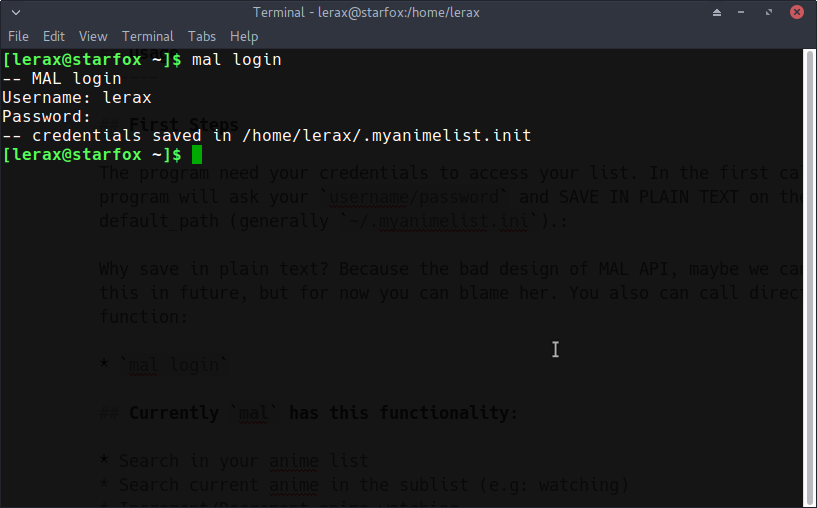
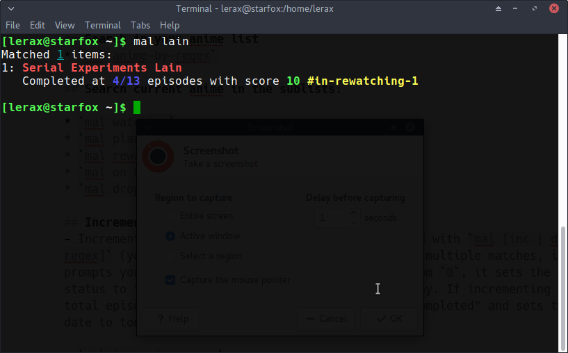
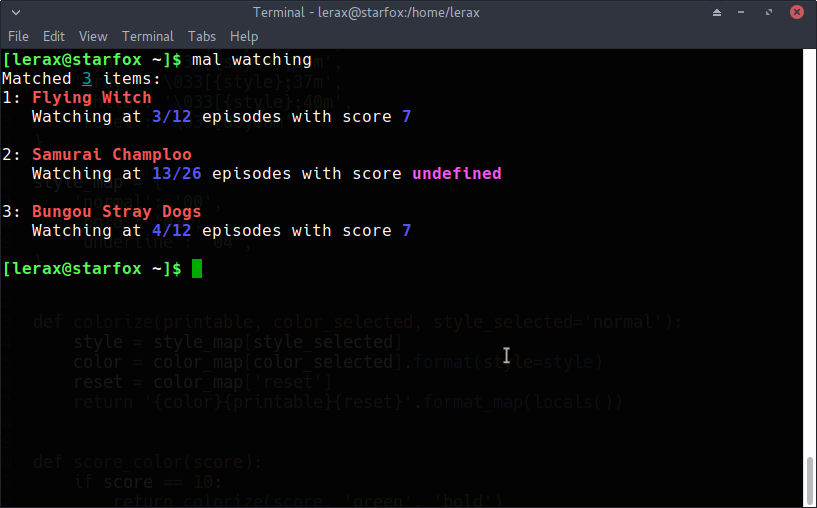
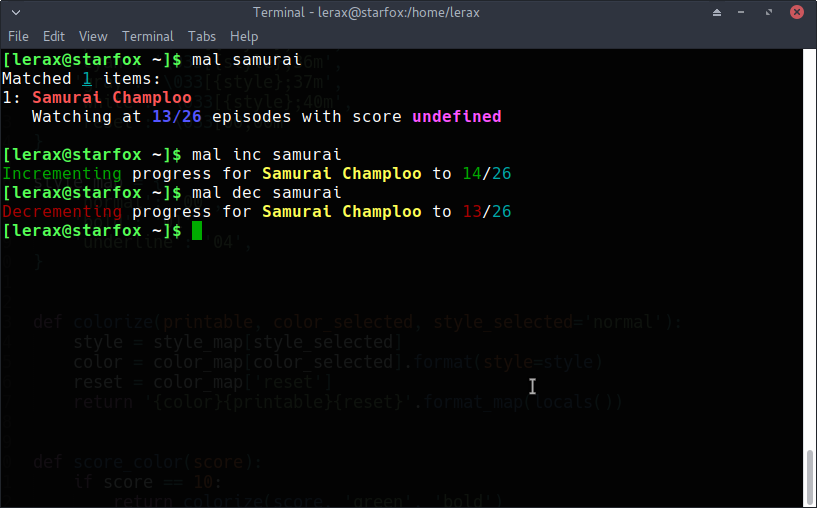

mal -- MyAnimeList Command Line Interface
=============

## Description
--------

`mal` is a command-line client for [MyAnimeList.net](http://myanimelist.net/). It uses their official [API](http://myanimelist.net/modules.php?go=api), so it should remain functional indefinitely (unlike screen-scraping alternatives). But is in alpha development yet, so new ideas is welcome! This version is a inspired tool from the slow-maintained [mal](https://github.com/pushrax/mal).


## Installation
---------

- `sudo python setup.py install`


## Requirements
-------

- Python 3.0+
- [requests](http://docs.python-requests.org/en/latest/index.html)


## Usage
------

## First Steps

The program need your credentials to access your list. In the first call, the program will ask your `username/password` and SAVE IN PLAIN TEXT on the default_path (generally `~/.myanimelist.ini`):


```init
[mal]
username = your_username
password = your_password

```

Why save in plain text? Because the bad design of MAL API, maybe we can change this in future, but for now you can blame her. You also can call directly this function:

* `mal login`



## Functionalities:

* Search in your anime list
* Search current anime in the sublist (e.g: watching)
* Increment/Decrement anime watching
* Score in final watching
* Fetch all anime list

## Search in your anime list 
* `mal anime-by-regex`



## Search current anime in the sublists:

* `mal watching`
* `mal plan to watch`
* `mal rewatching`
* `mal on hold`
* `mal dropped`



## Increment/Decrement
- Increment/Decrement the number of episodes watched with `mal [inc | dec] [regex]` (you can swap the order too!). If there are multiple matches, it prompts you to select which one. If incrementing from `0`, it sets the anime status to "watching" and sets the start date to today. If incrementing to the total episode count, it sets the anime status to "completed" and sets the end date to today.

* `mal inc anime-regex` 
  `mal anime-regex inc`
  `mal +1 anime-regex`
  `mal anime-regex +1`

* `mal dec anime-regex`
  `mal anime-regex dec`
  `mal -1 anime-regex dec`
  `mal -1 anime-regex dec`





# List all animes:

* `mal all`
* `mal list`
* `mal .+` (is regex right? :D)

# License

GPLv3